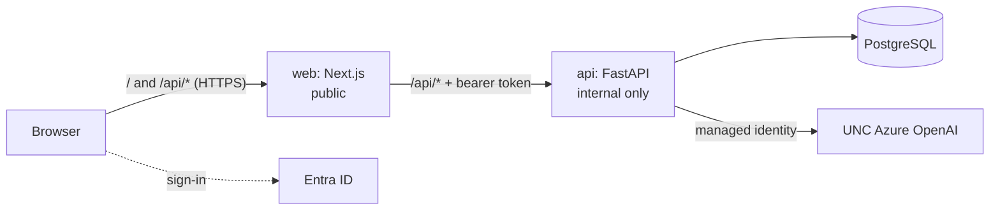

# {{ cookiecutter.project_name }}

{{ cookiecutter.project_description }}

A UNC-Chapel Hill Finance and Operations AI tool: a Next.js web app and a FastAPI
API, with Microsoft Entra ID sign-in (Onyen), UNC's Azure-hosted OpenAI models,
PostgreSQL, and Azure Container Apps, shipped through the standard
[FO-AI/automation](https://github.com/FO-AI/automation) CI/CD pipeline.



## Quick start (local)

Needs Python 3.11, Node 22, and Docker.

```bash
make install    # .venv + API and web dependencies
make dev        # Postgres in docker; API :8000 and web :3000 with hot reload
```

Open <http://localhost:3000>. Locally, sign-in is off and the AI is a mock that
echoes your prompt, so nothing in Azure is needed. To use the real models or real
sign-in, see [docs/local-development.md](docs/local-development.md).

`make check` runs everything CI runs. `make help` lists the rest.

## What's here

| Path | What |
| --- | --- |
| `web/` | Next.js 16 (App Router), Tailwind v4 with UNC tokens, MSAL sign-in, streaming chat, typed API client |
| `api/` | FastAPI: Entra token validation, AI provider layer (streaming, JSON output, embeddings), PostgreSQL + Alembic, audit trail |
| `deploy/env-contract.json` | Every setting each container may receive, and who owns it |
| `scripts/` | `ci.sh`, `publish.sh`, `cd.sh` (the FO-AI script contract) plus `smoke.sh`, `dev.sh` |
| `infra/` | Bicep and per-resource deploy scripts (run by hand, once per environment) |
| `docs/` | Architecture, local development, AI, security, runbook, ADRs |

## Building your tool

- **Add an API endpoint:** a router in `api/app/api/v1/routes/`, registered in
  `api/app/api/v1/router.py`; Pydantic schemas in `api/app/schemas/`; depend on
  `CurrentUser` (or `AdminUser`) for auth. Then `make generate-api` and commit
  `web/src/lib/api/schema.ts`.
- **Add a page:** `web/src/app/<route>/page.tsx`, a link in `NAV_ITEMS`
  (`web/src/components/AppShell.tsx`), and a client method in
  `web/src/lib/api/client.ts`. Load data with `useApiResource`.
- **Use AI:** depend on `AI` (`app/services/ai/factory.py`) and call `chat`,
  `stream_chat`, `complete_json(messages, MyPydanticModel)`, or `embed`. Keep
  prompts in `api/app/prompts/*.md`. See [docs/ai.md](docs/ai.md).
- **Add a table:** a model in `api/app/models/`, imported in
  `api/app/models/__init__.py`, then `make migration m="..."`.
- **Add a setting:** a field in `api/app/core/config.py`, an owner in
  `deploy/env-contract.json`, and the GitHub variable or secret. CI fails until
  all three agree.

- **Ask your documents (RAG):** see [docs/rag.md](docs/rag.md).


## Shipping

Every push to `main` runs CI; when it passes, `publish` builds both images once,
smoke-tests them, and pushes them to ACR, and CD promotes those exact digests to
the `dev` environment, verifies the site end to end, and rolls back on failure.
First-time Azure setup (resources, app registrations, GitHub variables) is in
[docs/runbook.md](docs/runbook.md).

## Docs

- [Architecture](docs/architecture.md)
- [Local development](docs/local-development.md)
- [AI layer and UNC Azure OpenAI](docs/ai.md)

- [Ask the documents (RAG)](docs/rag.md)

- [Security](docs/security.md)
- [Runbook: first deploy and operations](docs/runbook.md)
- [Architecture decision records](docs/adr/)
- [AGENTS.md](AGENTS.md): conventions for coding agents (and humans)
