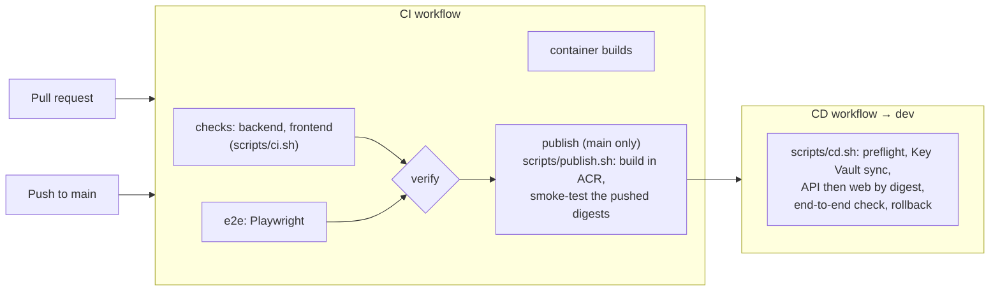

# Architecture

{{ cookiecutter.project_name }} is a Next.js web app in front of a FastAPI API. Only
the web app is reachable from the internet; it serves the UI and forwards `/api/*` to
the API, whose ingress is internal to the Container Apps environment. Everything
privileged (AI, data, storage) happens in the API.

## Components

```mermaid
flowchart TD
    subgraph Browser
      UI[React UI]
      MSAL[MSAL.js]
    end
    Entra[Microsoft Entra ID<br/>UNC tenant, Onyen sign-in]

    subgraph ACA[Azure Container Apps environment]
      Web["web (Next.js)<br/>public ingress"]
      API["api (FastAPI)<br/>internal ingress"]
    end

    PG[(PostgreSQL<br/>Flexible Server)]
    KV[Key Vault]
    AOAI[UNC Azure OpenAI]
    Blob[(Blob Storage)]
    AI2[App Insights /<br/>Log Analytics]

    Search[(Azure AI Search)]


    MSAL <-->|OIDC + PKCE| Entra
    UI -->|"same-origin /api/* + Bearer"| Web
    Web -->|"BACKEND_ORIGIN (internal FQDN)"| API
    API -->|JWKS| Entra
    API --> PG
    API -->|managed identity| AOAI
    API -->|managed identity| Blob

    API -->|managed identity| Search

    ACA -->|Key Vault references| KV
    API -->|OpenTelemetry| AI2
```

## A request, end to end

1. The user signs in with MSAL (authorization code + PKCE, redirect to `/auth`). The
   web app requests a token for the API scope `api://<api client id>/access_as_user`.
2. The UI calls a **same-origin** path such as `/api/v1/chat/stream` with
   `Authorization: Bearer <token>` (`web/src/lib/api/client.ts`).
3. The Next.js route `web/src/app/api/[...path]/route.ts` forwards the request
   unchanged to `BACKEND_ORIGIN` and streams the response back without buffering.
   No CORS is involved, and the API is never exposed publicly.
4. FastAPI validates the token (signature via JWKS, issuer, audience, expiry) and
   resolves a `Principal` with app roles (`app/core/security.py`).
5. The route calls the `AIProvider` (`app/services/ai/`); in Azure that is UNC's
   Azure OpenAI, reached with the API's managed identity. Streams are sent to the
   browser as server-sent events.
6. An audit event records the outcome, model, token usage and latency (never the
   prompt or answer); OpenTelemetry records request, dependency and `ai.*` spans.

## What belongs where

| Concern | Web | API |
| --- | --- | --- |
| Rendering, UX, client state | ✅ | |
| Sign-in and token acquisition (MSAL) | ✅ | |
| Forwarding `/api/*` (no logic) | ✅ | |
| **Token validation, authorization** | UX hints only | ✅ enforced |
| **AI calls, prompts** | ❌ never | ✅ |
| Database, storage, search | ❌ | ✅ |
| Secrets and credentials | ❌ | ✅ (Key Vault + managed identity) |

## Configuration model

- **Images are environment-agnostic.** Both images are built once per commit with no
  build arguments; everything environment-specific is an environment variable read
  at run time. The web app reads `BACKEND_ORIGIN` and `ENTRA_*` per request (no
  `NEXT_PUBLIC_` values); the only build-time flag is `NEXT_PUBLIC_AUTH_DISABLED`, so
  a published image can never have sign-in switched off.
- **One owner per setting.** `deploy/env-contract.json` lists every variable each
  container may receive and where it comes from (GitHub variable, GitHub secret via
  Key Vault, derived by the deploy, or set by infra). A test keeps it in sync with
  `api/app/core/config.py` and with what the web reads.
- **Infra creates, CD owns.** Bicep creates each container app once; after that the
  CD workflow owns its image and env (`scripts/cd.sh`).

## Pipeline



Both workflows call the reusable workflows in `FO-AI/automation`, pinned by commit.
See [ADR 0006](adr/0006-fo-ai-script-contract.md) and [runbook.md](runbook.md).

## Code map

| Area | Files |
| --- | --- |
| API entrypoint, middleware, errors | `api/app/main.py`, `api/app/core/` |
| Auth | `api/app/core/security.py`, `api/app/services/identity/current_user.py` |
| AI | `api/app/services/ai/` (providers, streaming), `api/app/prompts/` |

| RAG | `api/app/services/search/`, `api/app/api/v1/routes/rag.py`, `infra/search/` |

| Data | `api/app/models/`, `api/app/db/`, Alembic migrations in `api/app/db/migrations/` |
| Telemetry | `api/app/services/telemetry/` |
| Web auth | `web/src/lib/auth/` |
| Web → API | `web/src/app/api/[...path]/route.ts`, `web/src/lib/api/` |
| UI kit | `web/src/components/ui/`, tokens in `web/src/app/globals.css` |
| Deploy | `scripts/`, `deploy/env-contract.json`, `infra/` |
