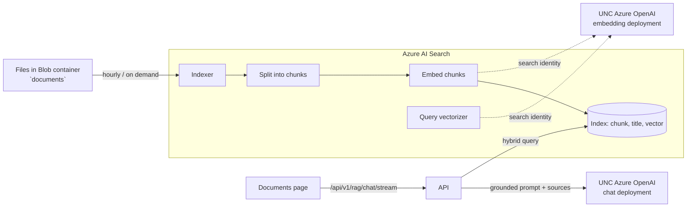

# Ask the documents (RAG)

This project was generated with `enable_ai_search=yes`. The **Documents** page answers
questions using only your team's documents, and every answer cites its sources.

## How it works



1. You put files (PDF, Word, Excel, PowerPoint, text, Markdown, HTML, CSV) in the
   `documents` blob container.
2. The search service's indexer (hourly, or on demand) extracts text, splits it into
   overlapping chunks, and embeds each chunk with UNC's Azure OpenAI embedding
   deployment. All of this runs inside Azure AI Search; the API does no indexing.
3. On a question, the API runs one **hybrid** query (keyword + vector; the index's
   vectorizer embeds the query), sends the top passages to the chat model with
   instructions to cite them as `[n]`, and streams the answer. The stream starts with a
   `citations` event that the UI shows under the answer.

Code: `api/app/services/search/` (retrieval), `api/app/api/v1/routes/rag.py` (route),
`api/app/prompts/rag.md` (grounding prompt), `web/src/app/documents/page.tsx` (UI).
Pipeline definitions: `infra/search/*.json`.

## Set it up

Prerequisites: the base infrastructure from [runbook.md](runbook.md) (identity, storage,
Key Vault, container apps) and an embedding deployment on UNC's Azure OpenAI resource.

1. **Create the search service** (also creates the `documents` container and lets the
   indexer read it):

   ```bash
   infra/scripts/deploy-search.sh -g <resource-group>
   ```

   Note the `searchPrincipalId` output.

2. **Hand-off to UNC (Azure OpenAI owners).** Ask them to grant **Cognitive Services
   OpenAI User** on the Azure OpenAI resource to:
   - the search service identity (`searchPrincipalId`), which embeds chunks and queries;
   - the app's managed identity (`identity.principalId` in your state file), which
     calls the chat model (needed for the base app too).

   Include the embedding deployment name and model (e.g. `text-embedding-3-small`).

3. **Create the pipeline** (needs *Search Service Contributor* on the service for you):

   ```bash
   infra/scripts/setup-search-index.sh -g <resource-group> \
     --aoai-endpoint https://<unc-resource>.openai.azure.com \
     --embedding-deployment <deployment> --embedding-model text-embedding-3-small \
     --dimensions 1536 --run
   ```

   Re-run it whenever you change `infra/search/*.json`; it updates in place.

4. **Configure the app.** Set these GitHub `dev` environment variables, then run CD:
   `AZURE_SEARCH_ENDPOINT` (printed by the script) and `AZURE_SEARCH_INDEX`
   (default `documents`).

5. **Add documents** with the portal, Azure Storage Explorer, or:

   ```bash
   az storage blob upload-batch --auth-mode login \
     --account-name <storage-account> -d documents -s ./my-docs
   ```

   The indexer picks them up within the hour, or start it from the portal.

## Tuning

| Want | Change |
| --- | --- |
| Bigger/smaller chunks | `maximumPageLength` / `pageOverlapLength` in `infra/search/skillset.json` |
| More or fewer sources per answer | `TOP_PASSAGES` in `api/app/api/v1/routes/rag.py` |
| Different file types | `indexedFileNameExtensions` in `infra/search/indexer.json` |
| How answers cite or refuse | `api/app/prompts/rag.md` |
| A different embedding model | `--embedding-model` and `--dimensions` (recreate the index) |
| Per-user or per-team document access | Add a filterable field and pass `filter=` in `AISearchRetriever._search` |

Locally, the Documents page needs a real search service; point `AZURE_SEARCH_ENDPOINT`
at the dev service and sign in with `az login` (you need *Search Index Data Reader*).
Tests use a fake retriever, so CI needs no Azure.
